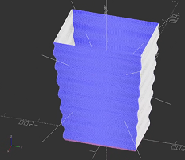

# openscad-models
Source and meshes for OpenSCAD models

## Highlights

| Model | Preview | Extra |
|-------|---------|-------|
| [wavy-bin](./wavy-bin/wavy-bin.stl) |  | [making-of VoD](https://www.twitch.tv/videos/1577531840) |

## Required software to edit and export
1. [OpenSCAD](https://github.com/openscad/openscad) -- _The Programmers Solid 3D CAD Modeller_
1. [BOSL](https://github.com/revarbat/BOSL) -- _The Belfry OpenScad Library - A library of tools, shapes, and helpers to make OpenScad easier to use_
1. [MCAD](https://github.com/openscad/MCAD) -- _OpenSCAD Parametric CAD Library_

## Each folder is an assembly
Many are single parts, but some have multiple parts.

## Start a new drawing
```sh
bash newscad.sh name-for-part
```
